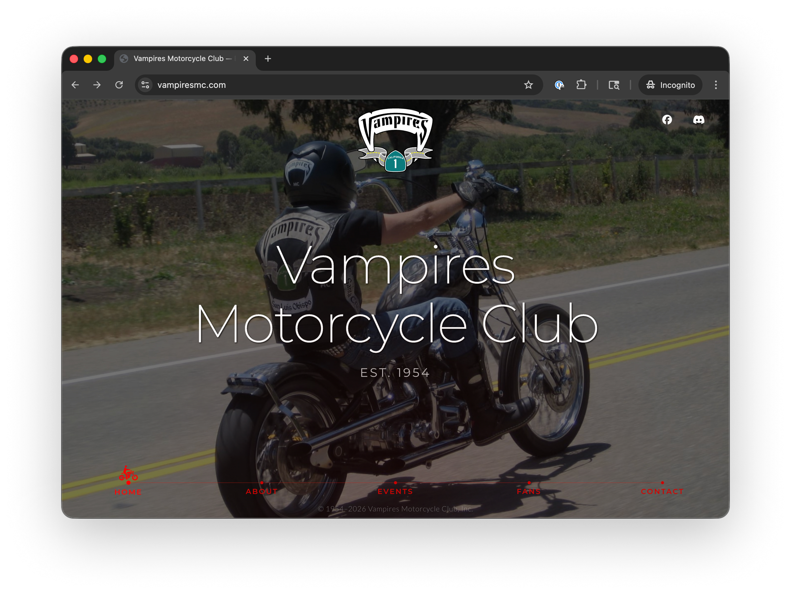

# Vampires Motorcycle Club



[](https://vampiresmc.com)
[](https://stage.vampiresmc.com)

Public site for [Vampires Motorcycle Club](https://www.facebook.com/vampiresmc), founded 1954, with chapters in Santa Cruz, San Francisco, and San Luis Obispo, CA.

## Stack

HTML5, SCSS, vanilla JS. No build step, no package manager — everything loads from CDN.

- [GSAP 3](https://gsap.com) — hero entrance + Discord count ticker
- [node-qrcode](https://github.com/soldair/node-qrcode) 1.4.4 — Discord QR (pinned; later versions are ESM-only)
- [Font Awesome 6.7.2](https://fontawesome.com), Google Fonts (Montserrat, Lato)
- Discord widget API — live online-member count

## Structure

```text
index.html
events.json          # Events panel data
js/main.js
styles/
  scss/              # source
    main.scss        # imports all partials
    _variables.scss  # colors, fonts, bp() mixin
    _reset.scss
    _typography.scss
    _sections.scss   # panel system, containers, button base
    _about.scss
    _events.scss
    _fans.scss
    _contact.scss
    _footer.scss     # bottom nav + copyright
    README.md        # bp() mixin reference
  css/               # compiled — do not edit
images/
  heroes/            # per-section slideshow images
  icons/
  logos/
```

## Assets

All graphics, logos, icons, and hero imagery live in [this Figma doc](https://www.figma.com/design/sGYKJYBjowvcPekhdk5STL/vampiresmc.com?node-id=0-1&t=AwxkK6qHpqbLZkJa-1). It's the source of truth — pull exports from there rather than regenerating. To access the file, contact [Ziad](mailto:ziad@feralcreative.co) for an invite.

## Local Development

SCSS compiles via the [Live Sass Compiler](https://marketplace.visualstudio.com/items?itemName=glenn2223.live-sass) VS Code extension on save. `index.html` loads the minified build. Serve locally with any static server.

`#viewport-widget` is a [dev helper](https://feralcreative.dev/utils) showing the current viewport size. An inline script removes it from the DOM on any non-local host, so it never ships to prod.

## Deployment

> **First deploy:** get `.vscode/sftp.json` from [Ziad](mailto:ziad@feralcreative.co) — it's git-ignored because it holds credentials, and the deploy scripts read connection details from it.

> **Staging auth:** `stage.vampiresmc.com` is behind HTTP basic auth — `user` / `pass`. Not a real secret, just there to keep bots and crawlers out.

```bash
./utils/deploy/stage.sh           # → stage.vampiresmc.com
./utils/deploy/prod.sh            # → vampiresmc.com
./utils/deploy/stage.sh --dry-run # preview
./utils/deploy/prod.sh  --force   # bypass prod git-clean / on-main gates
```

Each run: compile SCSS, bump the `.css?v=<timestamp>` in `index.html`, rsync with `--delete` over SSH, print a summary. Excludes live in `utils/deploy/ignore.json` — mirror any changes to `sftp.json`'s `ignore` array.

**Cache bust:** deploy rewrites `main.min.css?v=<...>` to `$(date '+%Y.%m.%d.%H%M')` at upload time, then reverts the local file so your working tree stays clean. Only `.css?v=` strings are touched — favicon and CDN URLs are not.

**Prod gates:** `prod.sh` refuses a dirty tree or non-main branch and requires typing `yes` to confirm. `--force` bypasses the git checks, not the prompt.

**Deps:** `rsync`, `ssh`, `jq`, `git`, `npx`. `brew install jq rsync`.

## Sections

Single-page horizontal scroll with five full-viewport panels. Nav: bottom dot nav, arrow keys, wheel/trackpad, touch swipes. Hash deeplinks work.

1. **Hero** — GSAP entrance over "Est. 1954"
2. **About** — club history and philosophy
3. **Events** — rendered from `events.json`, past events auto-filtered, capped at 6, sorted chronologically. Empty state points at Facebook/Discord.
4. **Fans** — single featured quote
5. **Contact** — Discord invite card: live member count (≥10 gated), join button, QR for desktop→mobile handoff

Each panel has a rotating background slideshow pulled from `images/heroes/{section}/` via [js/main.js](js/main.js).
